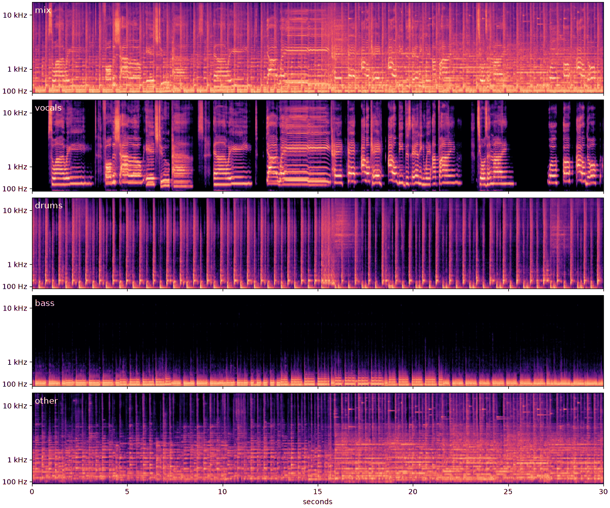

# slurper

A command-line tool that takes a YouTube URL or a local audio file and writes the mix plus vocals, horns, drums, bass, other and instrumental stems. It can also cut drum kits and bar-aligned loops from the stems, and write copies for the Elektron Digitakt II.

Version 0.1.0 (`slurper --version`).

## Requirements

- macOS 26 on Apple Silicon
- Xcode 26
- `brew install yt-dlp ffmpeg deno uv`

## Build, test, install

```
make build       # Release build in build/Build/Products/Release
make test        # unit tests with a coverage report
make install     # to ~/.local/bin (override with PREFIX=...)
make benchmark   # score against PyTorch demucs on the MUSDB18 test previews
make model       # rebuild the Core ML models from PyTorch
```

`make model` runs `scripts/convert_melband_roformer.py`, `scripts/convert_bs_roformer.py` and `scripts/convert_htdemucs.py` through uv, which installs PyTorch, coremltools and the model code into their own environments and downloads the checkpoints from Hugging Face. Each script checks the Core ML model against PyTorch on the GPU before installing it, replacing the downloaded one in `~/Library/Application Support/Slurper/Models/`.

Pushing a `v*` tag builds `slurper-macos-arm64.zip`, which holds the binary, and attaches it to a GitHub release. The build is unsigned, so clear the quarantine flag after unzipping:

```
xattr -d com.apple.quarantine slurper
```

## Use

```
slurper "https://www.youtube.com/watch?v=..." --digitakt
slurper song.wav --out ~/Desktop/stems
slurper song.wav --kit drums --loops drums,bass --digitakt
```

Files are written as 44.1 kHz float WAVs to `~/Music/Slurper/Stems/<title>/`, where `/`, `:` and `\` in the title become `-`, and ` 2`, ` 3`, ... is appended when the folder exists. The first run downloads the 490 MB vocal model, the 94 MB horns model and the 209 MB htdemucs model into `~/Library/Application Support/Slurper/Models` and compiles them, which takes a minute.

Model loading runs alongside the download, vocal chunks run two at a time on the GPU, and each stem is written as soon as it exists. Stems named in `--loops` wait for the drums' bar lines. A 135 s song took 30 s on an M4 Max before the horns stage, which adds a second RoFormer pass over the song (about a minute more on a 6 min track on an M1 Max).

## Example

Thirty seconds of "Swansong" by [Josh Woodward](https://www.joshwoodward.com/song/Swansong), from *Breadcrumbs* (2009), [CC BY 4.0](https://creativecommons.org/licenses/by/4.0/). Split with `slurper Swansong.mp3`, cut from 2:07 and encoded as 320 kbps MP3s in `assets/swansong/`:

[mix](assets/swansong/mix.mp3) · [vocals](assets/swansong/vocals.mp3) · [instrumental](assets/swansong/instrumental.mp3) · [drums](assets/swansong/drums.mp3) · [bass](assets/swansong/bass.mp3) · [other](assets/swansong/other.mp3)



`scripts/spectrogram.py` draws the figure, on one dB scale relative to the mix's peak.

## Stem quality

SDR in dB, mean over the 50 MUSDB18 test previews (340 s), Core ML build on an M4 Max:

| Pipeline | Vocals | Drums | Bass | Other | Average |
|---|---|---|---|---|---|
| slurper | 11.28 | 9.89 | 8.62 | 6.18 | 8.99 |
| htdemucs_ft (PyTorch) | 8.54 | 9.56 | 8.89 | 4.98 | 7.99 |
| htdemucs (PyTorch) | 8.41 | 9.54 | 8.47 | 4.91 | 7.83 |

SDR here is 10 log10(Σs² / Σ(s − ŝ)²) over both channels of a track. demucs runs without shifts and with overlap 0.25, as slurper does. slurper's vocals come from Mel-Band RoFormer, and its drums, bass and other from htdemucs run on the mix minus those vocals and the horns. MUSDB18's other target includes horns, so the benchmark scores slurper's other plus horns against it. The previews are lossy 7-second excerpts, so absolute scores sit below published MUSDB18-HQ numbers. The table was measured before the horns stage; `make benchmark` re-scores the current pipeline.

## Digitakt II export

`Digitakt II/<prefix>_<stem>.wav`: 48 kHz, 16-bit dithered PCM, stereo (mono when both channels match), one file per stem. `<prefix>` is the title's ASCII letters and digits, words joined by underscores and cut to 20 characters, or `song` when none are left. Elektronauts users report imports failing above about 59 MB, roughly 5 minutes of stereo; Elektron does not document a limit.

## Kits and loops

`--kit` and `--loops` take any of `mix`, `vocals`, `instrumental`, `horns`, `drums`, `bass` and `other`, comma-separated. Their files go next to the stem, and under `Digitakt II/` with the title prefix when `--digitakt` is on.

`--kit drums` writes `drums_kit/drums_01.wav`, `drums_02.wav`, ...: one example of each distinct hit, the most frequent first. Each hit is described by its levels in 24 mel bands in three windows ending 23, 46 and 93 ms after the attack, less its mean level so velocity doesn't split a sound. Hits within 6 dB RMS of a group's mean join it. Groups heard fewer than 3 times are dropped, unless no group reaches 3. Each group keeps, from the half of its hits nearest the group's mean, the one with the least tail from the hit before it and the most room before the next. A kit hit starts 3 ms before its attack, fades out over 5 ms, and runs at most 2 s.

`--loops drums,bass` writes `drums_loops_170bpm/drums_bar001.wav`, ...: 4-bar loops (`--bars N` to change), cut at the drum stem's bar lines so every stem's `bar017` lines up. Loops within 4.5 dB RMS of an earlier loop, compared by band levels at each 16th note, are left out, and so are silent ones. The tempo is the autocorrelation peak of the drums' onset envelope between 70 and 180 BPM, weighted toward 120 BPM, taking the faster of two tempos an octave apart when it correlates at least 80% as well. Beats come from Ellis's dynamic-programming tracker, the downbeat is the beat of the bar with the most onset strength below 150 Hz (assuming 4/4), and each bar line snaps to an attack within 30 ms. When the tempo lands on half or double what you count, pass `--bpm`. `--bars` and `--bpm` only apply with `--loops`.

Hits are found with spectral flux on the log magnitude (1024-sample frames, 256-sample hop, bins weighted per sixth octave so kicks aren't outvoted by cymbals), with an adaptive threshold, and placed to within one 64-sample block by the largest short-term level jump. Onsets closer than 50 ms merge, hits more than 40 dB below the stem's peak are dropped, and so are onsets where the level falls, which is what an abrupt stop looks like.

The thresholds come from synthetic drums and one 135 s drum and bass track, where the tracker found 170.00 BPM and every bar came within 17 ms of that tempo's bar length. On that track, kicks landing about 65 ms after another hit are missed (41 of 369 kick-band peaks). A 7 s loop at 144 BPM read as 72 BPM and needed `--bpm 144`. Nothing measures how steady a beat is, so drums without one can still produce a tempo and loops.

## Models

All three run on Core ML as `.mlpackage` bundles, compiled on first use and run on the GPU.

- Vocals: [Kim Mel-Band RoFormer](https://huggingface.co/KimberleyJSN/melbandroformer) (MIT weights), downloaded from [TrevorJS/MelBandRoformer-Vocal-CoreML](https://huggingface.co/TrevorJS/MelBandRoformer-Vocal-CoreML). `scripts/convert_melband_roformer.py` follows the [coreai-model-zoo](https://github.com/john-rocky/coreai-model-zoo) recipe: the STFT and inverse STFT become constant DFT matmuls inside the graph, the band average becomes a matmul and the complex mask multiply becomes real arithmetic, so the graph is `frames[1,2,801,2048] -> recon[1,2,801,2048]` in float16 and `Sources/SlurperKit/RoformerSeparator.swift` only frames and overlap-adds. On an 8 s chunk with vocals the Core ML output matches PyTorch at cosine 0.99995 (39.6 dB SDR).
- Horns (brass and woodwinds): the wind stem of the [MVSep Mega 53-stem BS-RoFormer](https://github.com/ZFTurbo/Music-Source-Separation-Training/releases/tag/v1.0.21), from its [single-stem repack](https://huggingface.co/noblebarkrr/BS-Roformer-MVSep-Mega-53-stems), downloaded from [benkaron/BSRoformer-Wind-CoreML](https://huggingface.co/benkaron/BSRoformer-Wind-CoreML). `scripts/convert_bs_roformer.py` is the vocal recipe with hop 512 (690 frames per 8 s chunk) and no band average, since BS-RoFormer's 62 bands tile the spectrum; the same Swift host runs it. On an 8 s chunk of big-band horns over a rhythm section (the Airmen of Note's "Blues for Mundy", a public-domain US Air Force Band recording) the Core ML output matches PyTorch at cosine 0.99998 (44.7 dB SDR). It takes the horns off the instrumental, before htdemucs, so "other" is the comping instruments.
- Drums, bass, other: [htdemucs](https://github.com/facebookresearch/demucs) (Meta, MIT), downloaded from [TrevorJS/htdemucs-CoreML](https://huggingface.co/TrevorJS/htdemucs-CoreML). `scripts/convert_htdemucs.py` exports the model's real-valued core for one 7.8 s segment with coremltools, in float32 because float16 overflows, and checks it against PyTorch before saving it: 100-128 dB SDR per stem on a synthetic segment. `Sources/SlurperKit/Demucs.swift` does the STFT, inverse STFT and segment crossfades around it, matching demucs's PyTorch code. Segments run one at a time.
